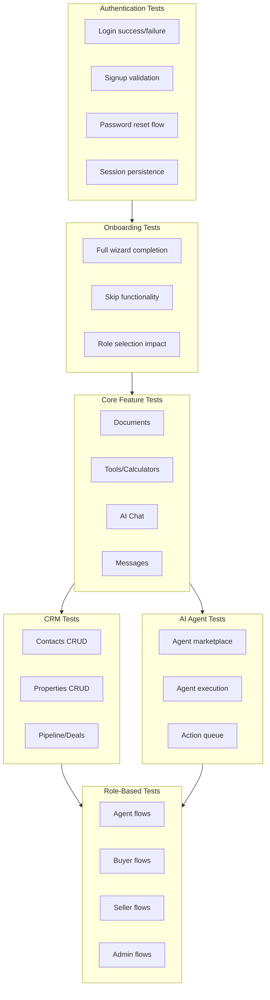

# Comprehensive E2E Test Suite Plan

## Test Architecture




## New Test Files to Create

### 1. Documents Tests - `documents.spec.ts`

**Location:** [tests/e2e/documents.spec.ts](tests/e2e/documents.spec.ts)

**Test Scenarios:**

- Display documents page with empty state
- Upload a PDF document (mock file)
- Show document processing/indexing status
- Display indexed document in list
- Open document detail view
- Delete a document
- Create a document project/folder
- **Multi-document chat:** Select multiple docs and ask a question
- **Error handling:** Upload invalid file type, file too large
- **Edge cases:** Special characters in filename, duplicate upload

---

### 2. Tools/Calculators Tests - `tools.spec.ts`

**Location:** [tests/e2e/tools.spec.ts](tests/e2e/tools.spec.ts)

**Test Scenarios:**

- Display tools page with calculator grid
- **Mortgage Calculator:** Input loan amount, rate, term → verify monthly payment
- **Affordability Calculator:** Input income, debts → verify max home price
- **Closing Costs Calculator:** Input price, location → verify estimates
- **Commission Calculator:** Input sale price, rate → verify commission
- **Net Sheet Calculator:** Input sale price, costs → verify net proceeds
- **Rent vs Buy Calculator:** Compare scenarios
- **Error handling:** Invalid inputs (negative numbers, letters in number fields)
- **Edge cases:** Very large numbers, zero values, boundary conditions
- **Checklists:** Verify buying/selling checklist items can be checked

---

### 3. AI Agents Tests - `ai-agents.spec.ts`

**Location:** [tests/e2e/ai-agents.spec.ts](tests/e2e/ai-agents.spec.ts)

**Test Scenarios:**

- Display agents marketplace
- Browse agents by category
- View agent details
- Add agent to favorites
- Remove agent from favorites
- **Execute an agent:** Select agent, provide input, run
- View agent execution history
- **Error handling:** Execute agent without required input
- **Edge cases:** Long-running agent timeout handling

---

### 4. Action Queue Tests - `action-queue.spec.ts`

**Location:** [tests/e2e/action-queue.spec.ts](tests/e2e/action-queue.spec.ts)

**Test Scenarios:**

- Display action queue (may be empty initially)
- View pending action details
- Approve a pending action
- Reject a pending action with reason
- Batch approve multiple actions
- Filter actions by status (pending, approved, completed, failed)
- **Error handling:** Approve already-processed action
- **Edge cases:** Queue with many items, rapid approve/reject

---

### 5. Property Search Tests - `property-search.spec.ts`

**Location:** [tests/e2e/property-search.spec.ts](tests/e2e/property-search.spec.ts)

**Test Scenarios:**

- Display property search page
- Search by location (city, zip)
- Apply filters (beds, baths, price range, sqft)
- Filter by property type (house, condo, townhouse)
- Toggle for sale / for rent
- View search results
- Save a property to favorites
- View saved properties list
- Remove property from saved
- **Error handling:** Search with no results, invalid location
- **Edge cases:** Filter combinations, clear all filters

---

### 6. Messages Tests - `messages.spec.ts`

**Location:** [tests/e2e/messages.spec.ts](tests/e2e/messages.spec.ts)

**Test Scenarios:**

- Display messages page (empty state or list)
- Start new conversation
- Send a message
- Receive message (mock or use second browser context)
- View conversation history
- Mark messages as read
- **Error handling:** Send empty message, very long message
- **Edge cases:** Special characters, emojis, links in messages

---

### 7. Role-Based Flow Tests - `role-flows.spec.ts`

**Location:** [tests/e2e/role-flows.spec.ts](tests/e2e/role-flows.spec.ts)

**Test Scenarios:**

**Agent Flow:**

- Sign up as agent → see agent-specific navigation
- Access Contacts, Pipeline, Properties, Documents
- Cannot access buyer-only pages (property search, saved)

**Buyer Flow:**

- Sign up as buyer → see buyer-specific navigation
- Access Property Search, Saved Properties, My Journey
- Cannot access agent-only pages (Contacts, Pipeline as manager)

**Seller Flow:**

- Sign up as seller → see seller-specific navigation
- Access My Listing, My Journey
- Cannot access agent-only or buyer-only pages

**Admin Flow:**

- Login as admin → see admin navigation item
- Access Admin dashboard, Teammates, Data Sources
- Test role testing mode (switch to view as buyer/seller)

---

### 8. Settings Tests - `settings.spec.ts`

**Location:** [tests/e2e/settings.spec.ts](tests/e2e/settings.spec.ts)

**Test Scenarios:**

- Display settings page with all sections
- **Profile editing:** Update name, title, phone → verify saved
- **Notifications:** Toggle email, push, deal update notifications
- **Appearance:** Toggle dark mode → verify theme changes
- **Data export:** Request data export
- **Error handling:** Save with invalid phone format
- **Accessibility:** Verify form labels, focus states

---

### 9. Password Reset Tests - `password-reset.spec.ts`

**Location:** [tests/e2e/password-reset.spec.ts](tests/e2e/password-reset.spec.ts)

**Test Scenarios:**

- Navigate to forgot password from login
- Submit email for password reset
- Display success message
- **Error handling:** Submit invalid email, non-existent email
- **Edge cases:** Submit empty form, rapid resubmit

---

### 10. Accessibility Tests - `accessibility.spec.ts`

**Location:** [tests/e2e/accessibility.spec.ts](tests/e2e/accessibility.spec.ts)

**Test Scenarios:**

- Run axe accessibility audit on key pages:
  - Landing page
  - Login/Signup forms
  - Dashboard
  - Contacts list and form
  - Pipeline view
  - Settings page
- Verify keyboard navigation works
- Verify focus management on modals/dialogs
- Check color contrast (use `@axe-core/playwright`)

---

## Test Helpers to Add

Update [tests/e2e/fixtures/helpers.ts](tests/e2e/fixtures/helpers.ts):

```typescript
// New helper functions needed:
- signUpAsRole(page, role: 'agent' | 'buyer' | 'seller')
- uploadDocument(page, filePath: string)
- createContact(page, contactData)
- createDeal(page, dealData)
- createProperty(page, propertyData)
- waitForToast(page, text: string)
- checkAccessibility(page) // using axe-core
```

---

## Execution Order

Tests should run in dependency order:

1. `auth.spec.ts` - Foundation (login required for all)
2. `password-reset.spec.ts` - Auth-related
3. `onboarding.spec.ts` - New user setup
4. `settings.spec.ts` - User configuration
5. `documents.spec.ts` - Document foundation for AI
6. `tools.spec.ts` - Standalone calculators
7. `contacts.spec.ts` - CRM foundation
8. `properties.spec.ts` - Property foundation
9. `deals.spec.ts` - Depends on contacts
10. `property-search.spec.ts` - Property discovery
11. `messages.spec.ts` - Communication
12. `ai-agents.spec.ts` - AI features
13. `action-queue.spec.ts` - AI action management
14. `role-flows.spec.ts` - Role-specific validation
15. `accessibility.spec.ts` - Cross-cutting quality
16. `full-user-journey.spec.ts` - Integration validation

---

## Dependencies to Add

```bash
npm install -D @axe-core/playwright
```

---

## Estimated Test Count


| Test File               | Scenarios   | Est. Tests     |
| ----------------------- | ----------- | -------------- |
| documents.spec.ts       | 11          | ~15            |
| tools.spec.ts           | 10          | ~20            |
| ai-agents.spec.ts       | 9           | ~12            |
| action-queue.spec.ts    | 8           | ~10            |
| property-search.spec.ts | 11          | ~15            |
| messages.spec.ts        | 8           | ~10            |
| role-flows.spec.ts      | 4 roles × 3 | ~12            |
| settings.spec.ts        | 6           | ~10            |
| password-reset.spec.ts  | 5           | ~6             |
| accessibility.spec.ts   | 8 pages     | ~10            |
| **Total New**           |             | **~120 tests** |
| **Existing**            |             | **~40 tests**  |
| **Grand Total**         |             | **~160 tests** |


